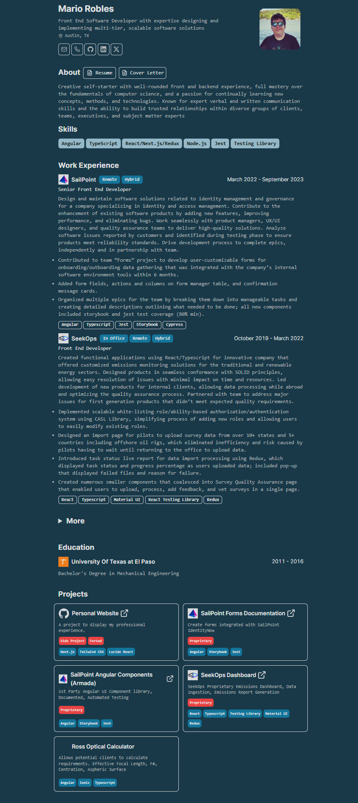

# Minimalist Resume

Simple web app that renders professional resume with print-friendly layout.

Built with Next.js and shadcn/ui.

Original Template by: https://github.com/BartoszJarocki/cv
# Features

- Setup only takes a few minutes [single config file](./src/data/resume-data.tsx)
- Built using Next.js 14, React, Typescript, Shadcn/ui, TailwindCss
- Auto generated Layout
- Responsive for different devices
- Optimized for Next.js and Vercel
### Features by Mario Robles
- Logo Support
- Resume and Cover Letter links
- Collapsable "More" section
- Technologies Tags on Work Experience
- Additional Tags on Projects
- Multiple styling changes

# Getting Started Locally

1. Clone this repository to your local machine:

   ```bash
   git clone https://github.com/mariorobles93/Personal-Website.git
   ```

2. Move to the cloned directory

   ```bash
   cd Personal-Website
   ```

3. Install dependencies:

   ```bash
   yarn install
   ```

4. Start the local Server:

   ```bash
   yarn dev
   ```

5. Open the [Resume Data File](./src/data/resume-data.tsx) and make changes

# Run with Docker

Build the container

```
docker compose build
```

Run the container

```
docker compose up -d
```

Stop the Container

```
docker compose down 
```

# License

[MIT](https://choosealicense.com/licenses/mit/)
